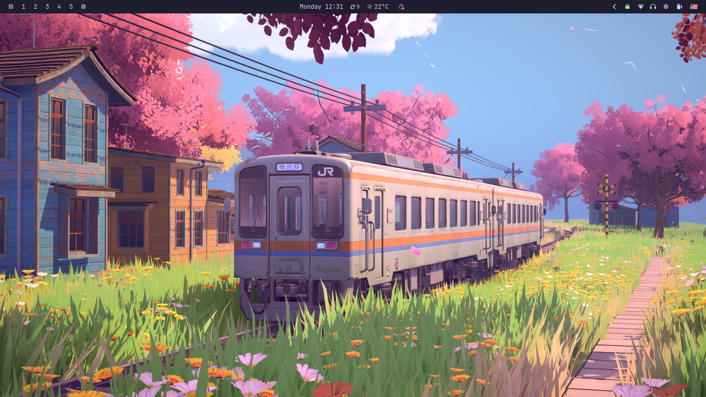

# 🏡 Dotfiles — Angel Altuve

Mis configuraciones personales de Linux, gestionadas con **GNU Stow**.



## 📁 Estructura

Cada programa vive en su propio directorio y se despliega con Stow:

```
.dotfiles/
├── alacritty/   →  ~/.config/alacritty
├── sway/        →  ~/.config/sway
├── nvim/        →  ~/.config/nvim
├── zsh/         →  ~/.config/zsh
├── waybar/      →  ~/.config/waybar
├── home/        →  ~/.zshenv  ~/.profile
└── ...
```

## 🚀 Instalación

### Dependencias

```bash
# Arch Linux
pacman -S stow alacritty sway waybar rofi mako foot kitty imv yazi zsh tmux neovim sc-im gtk3 gtk4 qt5ct qt6ct fontconfig yt-dlp aria2 wget newsboat podboat rmpc mpv pandoc lazygit calcurse btop htop fastfetch eza zathura

# Debian / Ubuntu
apt install stow alacritty sway waybar rofi mako foot kitty imv zsh tmux neovim gtk3 gtk4 qt5ct qt6ct fontconfig yt-dlp aria2 wget newsboat podboat mpv pandoc lazygit calcurse btop htop fastfetch eza zathura

# Fedora
dnf install stow alacritty sway waybar rofi mako foot kitty imv zsh tmux neovim gtk3 gtk4 qt5ct qt6ct fontconfig yt-dlp aria2 wget newsboat podboat mpv pandoc lazygit calcurse btop htop fastfetch eza zathura
```

> Algunos paquetes como `yazi`, `sc-im`, `rmpc`, `paru` y `yay` pueden requerir AUR, COPR o instalación manual.

### Despliegue

```bash
git clone git@github.com:angelaltuve/dotfiles.git ~/.dotfiles
cd ~/.dotfiles
stow */
```

## 📦 Paquetes incluidos

| Categoría | Apps |
|-----------|------|
| **WM/UI** | Sway, Waybar, Rofi, Mako, Foot, Alacritty, Kitty, IMV, Yazi |
| **Shell** | Zsh, Tmux, Shell scripts |
| **Editores** | Neovim, SC-IM |
| **GTK/Qt** | GTK3/4, Qt5ct, Qt6ct, Fontconfig |
| **Descargas** | yt-dlp, Aria2, Wget, Newsboat, Podboat, RMPC, MPV |
| **Dev** | Pandoc, Lazygit, Mise, Calcurse |
| **AUR** | Paru, Yay |
| **Sistema** | Btop, Htop, Fastfetch, Eza, Zathura |
